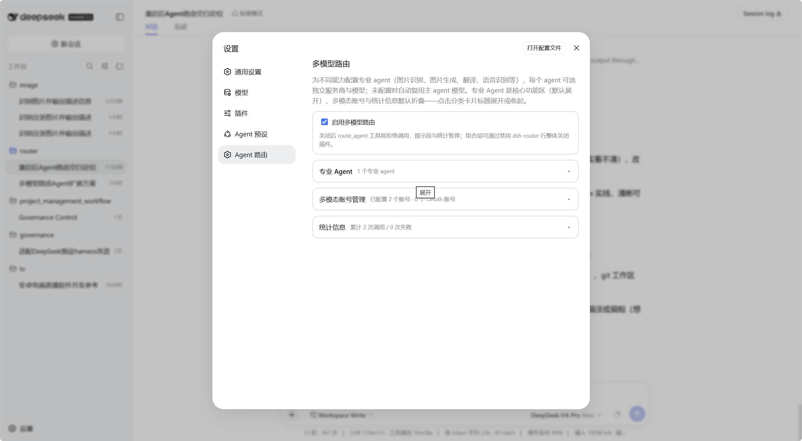
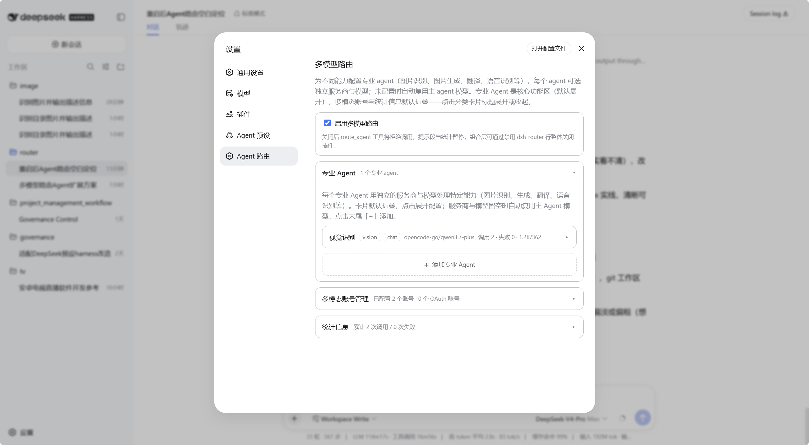
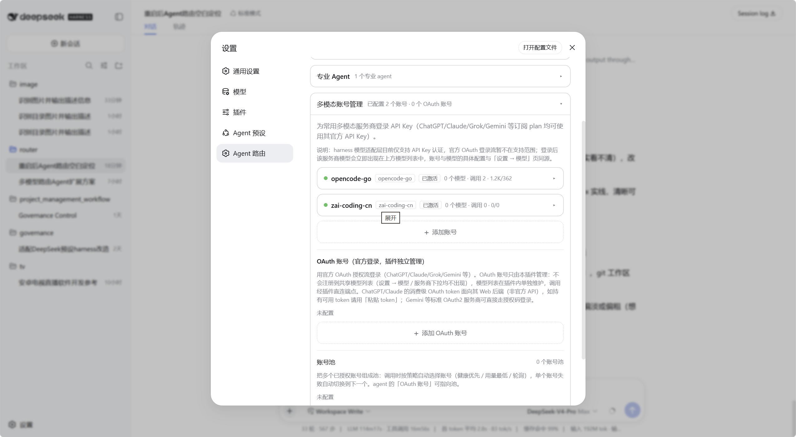
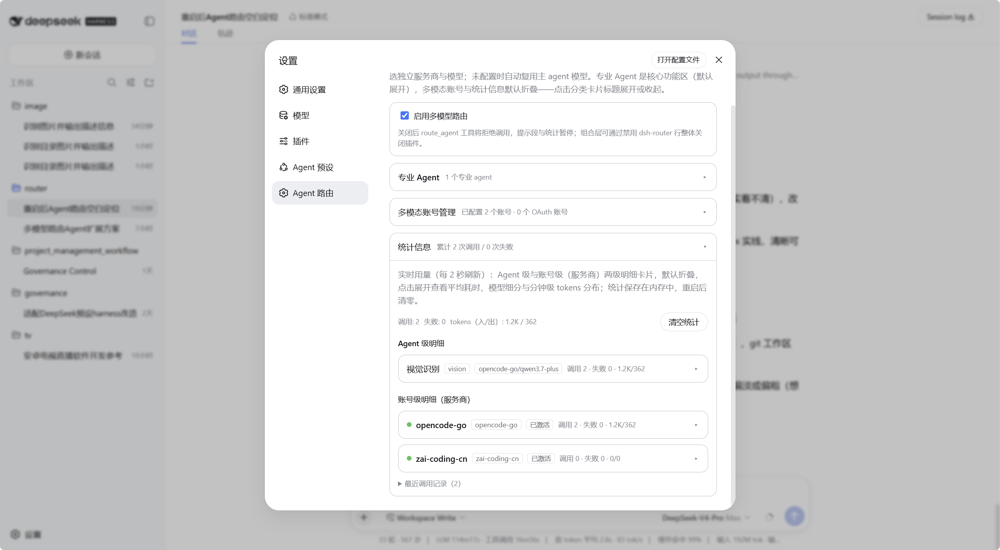

# dsh-agent-router

> 专业的事情，交给专业的 agent。
>
> DeepSeek Harness（DSH）多模型路由插件：为任意 DSH 主 agent 挂载专业 agent 目录，按任务自动路由到带独立模型的视觉、翻译、语音、子代理等专业 agent，扩展主 agent 的能力边界。

[](https://github.com/peterwangze/dsh-agent-router/releases)
[](LICENSE)

## 项目目标

专业的事情交给专业的 agent：支持**自定义任意类型 agent**并配置对应的文本模型/多模态模型，扩展任意 DSH 主 agent 的能力边界——图片识别与生成、语音识别与转写、视频脚本与字幕、翻译、复杂子任务委派等任意专业能力，一套工具完成多模型协同。

## 特性

- 🧭 **自定义专业 Agent（核心）**：五种执行通路（chat 远端模型 / agent 完整子代理 / cli 无头 CLI 子代理 / image 图片生成 / speech 语音转写）+ 自定义能力标签，主 agent 按标签自动路由；每个 agent 独立服务商与模型，未配置自动复用主 agent 模型
- 🖼 **多模态任务路由**：图片识别（OCR、截图、图表）、图片生成（v0.4.1 起 ChatGPT 订阅直连出图，gpt-image 系）、语音转写；`files` 参数按能力分发——图片内联注入、文本内联、任意文件交给 agent / cli 类型子代理读取
- 💬 **对话框图片能力**：启用视觉类专业 agent（能力标签含 `image`）后，输入框出现「添加图片」按钮——附件图片进入原生草稿栏随消息原生发送，会话日志保留原件（界面原生显示）；插件在 system 层注入路由提示，主 agent 按需调用 route_agent（`includeImages` 把最近消息的图片转发给视觉 agent，自动附带主会话最近上下文，截图真正成为对话上下文的一部分）；生成图片经插件同源画布直达显示（v0.4.1 起：`/router-assets/` 内容寻址同源路由，不再依赖宿主附件通道；route_agent 工具卡默认折叠、输入区 🖼 按钮汇总会话产物；纯插件机制：带图轮始终由主模型应答，纯文本主模型全程不接触图片字节）
- 🤖 **无头 CLI 子代理（Codex / Claude / Gemini）**：把 `codex` / `claude` / `gemini` 等外部 agent 工具作为子代理接入——无头模式（`codex exec --json` / `claude -p` / `gemini -p`）在工作区内自动执行多步任务，图片与文件按工作区路径注入；CLI 使用自身登录态（各自终端登录一次），插件零 OAuth 对接
- 🔑 **多模态账号**：任意服务商 API Key 配置式添加（官方/中转/本地部署同一条路径，无预设无登录）；ChatGPT 订阅登录（正式通道，官方 Codex OAuth 通路一键授权）；无头 CLI 子代理（Codex / Claude / Gemini，插件零 OAuth 对接）；账号池按健康/用量/轮询策略自动选号与失败切换（官方 API 不提供 OAuth——v0.3.2 起已移除不可用的「OAuth 官方登录」入口）
- ⚡ **主模型官方路由（v0.4.1 起）**：ChatGPT 订阅主模型默认经宿主官方 openai-codex 路由——模型选择器直接可选订阅模型组，OAuth token 由插件自动注入刷新（订阅卡可随时切回「插件内置」通路）
- 📊 **实时用量统计**：Agent 级与账号级两级明细（调用/失败/tokens/耗时）、分钟级 tokens 分布、最近调用记录；用量按天持久化（缺省落盘 `$DSH_HOME`、保留 90 天，重启不清零；`router.stats.persist=false` 可关闭）、按天视图与 CSV 导出
- 🔌 **零配置接入**：宿主平面注册 `route_agent` 工具与路由提示段，内置与自定义的任意 agent 预设自动获得路由能力

## 安装

### 在线安装（一条命令）

| 平台 | 命令 |
| --- | --- |
| Windows（PowerShell） | `powershell -ExecutionPolicy Bypass -Command "iex (((irm https://raw.githubusercontent.com/peterwangze/dsh-agent-router/main/install.ps1) -join [Environment]::NewLine).TrimStart([char]0xFEFF))"` |
| macOS / Linux | `curl -fsSL https://raw.githubusercontent.com/peterwangze/dsh-agent-router/main/install.sh \| sh` |

安装脚本自动完成：克隆源码 → 链接到 `~/.dsh/profiles/node_modules/` → 在 `profiles/web/cordis.patch.yml` 写入宿主行（幂等，可重复执行）。完成后**重启 DSH** 即可。

固定版本：把命令中的 `main` 换成版本号，如 `v0.4.1`。

### 离线安装

1. 下载发行包：[dsh-agent-router-v0.4.1.tar.gz](https://github.com/peterwangze/dsh-agent-router/releases/download/v0.4.1/dsh-agent-router-v0.4.1.tar.gz)
2. 解压并进入包目录：

```powershell
# Windows
tar -xzf dsh-agent-router-v0.4.1.tar.gz
cd dsh-agent-router-v0.4.1
powershell -ExecutionPolicy Bypass -File .\install.ps1 -LocalPath .
```

```sh
# macOS / Linux
tar -xzf dsh-agent-router-v0.4.1.tar.gz
cd dsh-agent-router-v0.4.1
./install.sh --local .
```

### 让 AI 帮你装（对话安装）

把下面这段提示词发给 DSH 主 agent 或 ChatGPT / Claude / Gemini 等任意主流 agent，它会自动检测平台并完成安装：

```text
请帮我在 DeepSeek Harness 上安装「dsh-agent-router」多模型路由插件：

1. 检测当前系统平台，在终端执行对应安装命令：
   - Windows（PowerShell）：
     powershell -ExecutionPolicy Bypass -Command "iex (((irm https://raw.githubusercontent.com/peterwangze/dsh-agent-router/main/install.ps1) -join [Environment]::NewLine).TrimStart([char]0xFEFF))"
   - macOS / Linux：
     curl -fsSL https://raw.githubusercontent.com/peterwangze/dsh-agent-router/main/install.sh | sh
2. 等待命令执行完成，确认输出包含「安装完成」。
3. 提醒用户重启 DeepSeek Harness。
4. 重启后打开「设置 → Agent 路由」，用预设模板添加专业 Agent（如视觉识别）。
```

## 使用指南

安装并重启后，在 DSH 的「设置 → Agent 路由」打开配置页。

### 1. 总览



- 顶部**总开关**：启用多模型路由（关闭后 route_agent 拒绝调用、统计暂停）
- 四个**分级分类卡片**，点击标题展开/收起：
  - **预设 Agent**（第一张，默认折叠）：按 DSH 预设粒度配置默认模型
  - **专业 Agent**（核心区，默认展开）：维护自定义专业 agent
  - **多模态账号**（默认折叠）：API Key 账号、ChatGPT 订阅登录、子代理（无头 CLI）与账号池
  - **统计信息**（默认折叠）：实时用量明细
- 分类头实时显示摘要（预设数量、agent 数量、账号数量、调用统计），无需展开即可掌握概况

### 2. 预设 Agent 默认模型

「预设 Agent」卡片按 **DSH 预设**（governance / novel-writing 等宿主预设）为粒度配置默认模型：让不同预设的新会话默认落在不同模型上（例如 governance 用强推理模型、写作预设用便宜长文模型），无需每次新建会话手动切换。

- **添加**：展开卡片 →「+ 添加预设配置」→ 统一模板内联表单——下拉选择宿主预设（自动列出宿主预设与信任级别；已配置的预设不再出现；损坏的预设标记不可选）→ 主 Agent 默认模型（服务商 + 模型）→ subagent 默认模型（服务商 + 模型，**留空 = 继承主 Agent 模型**）→ 添加
- **条目管理**：每个预设一行摘要（预设 · 主模型 · subagent 模型/继承），点击展开编辑、删除；宿主侧已删除的预设其残留配置会提示「预设已不存在」，可删除清理
- **语义（事件驱动，打开即显示）**：
  - **打开即显示**：新开（或空白切换）某预设的会话时，对话框模型选择器**立即显示**该预设配置的默认模型——无需先发消息；空白会话切换预设时**实时跟随**新预设的配置，切到无配置的预设则回落 DSH 全局默认
  - **首条消息后锚定**：发出第一条消息后，会话模型由请求日志锚定（宿主原生行为）——后续配置修改不再影响该会话
  - **手动选择即当前会话生效**：会话内手动切换模型 = 宿主原生会话内选择，插件不监听、不干预、不打架
  - **主 Agent 默认模型**：仅对空白会话（无请求日志）生效；已运行会话（重启恢复的已产出对话）始终优先，不受配置影响；未设置 = 完全遵循 DSH 现行规则（零行为变化）
  - **subagent 默认模型**：该预设派生的 subagent 的默认模型；未设置时 subagent 继承主预设 Agent 的设置；显式指定模型的子代理（如插件专业 agent 委派、workflow 指定模型）不受影响
- **实现机制**：模型跟随两个预设事件（agent 创建 / 空白切换），**不介入会话过程**（无请求流拦截，会话进行中零插件开销）；主会话显示播种借用宿主会话模型选择通路，其附带的全局默认写入**立即自动写回恢复**（瞬态毫秒级，通常不可感知）——恢复失败时自动重试一次，仍失败则在日志高声告警并提示手动改回原全局默认；多个播种事件并发到达时（宿主不等待事件监听器完成）按内部**串行化队列**依次执行，并发交错不会污染全局默认的写回恢复
- **已知行为披露**：重启后重新打开**从未发过消息的空白预设会话**，同样会触发显示播种（宿主在恢复会话时也发出 agent 创建事件）——与「打开即显示」语义一致；已发过消息的会话不受影响（日志锚定）。全局默认模型（「设置 → 模型」）在播种成功且恢复正常的情况下保持不变；保存后热生效，无需重启。宿主发出预设事件后**不等待播种完成**（fire-and-forget）——播种按内部串行化队列依次处理（极小窗口内并发创建的多个会话各自正确播种、全局默认仍恢复正确），但会话创建后到播种完成前的毫秒级窗口内，首个请求可能短暂路由到全局默认模型，显示与实际路由随后自动一致（人手操作通常不可感知）

### 3. 专业 Agent 配置



每个 agent 卡片默认折叠为一行摘要（名称 / 类型 / 生效模型 / 简要用量），点击展开配置：

- **名称、类型**：类型只是执行方式（chat 调远端模型 / agent 委派 DSH 子代理 / cli 无头 CLI 子代理 / image 图片生成 / speech 语音转写），不限制能力；**能力标签**才是自定义的调度契约（路由与 files 图片分发都按它判定）
- **服务商 / 模型**：留空自动复用主 agent 模型；「发现模型」按钮可拉取服务商模型列表一键选用（cli 类型下模型字段作为 CLI 的 `-m / --model` 参数）
- **cli 类型**：执行方式切到 cli 后，从「子代理」下拉选择**账号区已添加的 CLI 条目**作为执行路径（未选择 = 旧形态内嵌命令，提示迁移）。卡片保留登录状态指示、模型覆盖字段（`-m / --model`，空 = CLI 默认模型）与底部「登录」按钮；命令、参数、登录、拉取模型与统计统一在「多模态账号 → 子代理」维护
- **能力说明**：主 agent 据此判断何时调用该 agent
- 高级设置：推理强度、温度、最大输出、轮数、System prompt、工具白名单（agent 类型）；cli 类型高级设置仅保留能力标签与 System prompt（注入任务头部作角色设定）
- 操作：启用开关、保存、测试（cli 类型 = 登录状态检查）、删除；底部显示该 agent 的实时用量与 tokens 分布
- 列表末尾「+」用预设模板快速添加：视觉识别 / 图片生成 / 翻译 / 语音识别 / 视频生成 / 通用子 Agent（模板只是能力起点；Codex/Claude/Gemini 等 CLI 工具不是 agent 类别，而是任意 agent 在 cli 执行方式下可选的子代理路径）
- **对话框图片**：启用带 `image` 能力标签的视觉类专业 agent（chat / agent / cli 类型）后，对话输入框出现「添加图片」按钮——选中图片进入原生附件栏随消息原生发送；图片保留在会话日志中原生显示，插件在 system 层注入路由提示，主 agent 按需调用 route_agent 交给视觉 agent 分析（`includeImages` 转发最近消息的图片，**自动附带主会话最近上下文**——截图是对话上下文的一部分，视觉 agent 结合上下文作答）。生成图片以缩略图显示在 route_agent 工具卡片里（点击查看原图），纯文本主模型全程不接触图片字节

### 4. 多模态账号配置



- **API Key 账号**：统一配置式添加——服务商 ID（openai / my-gateway / one-api 等）+ 接口类型（openai-completions / openai-responses / anthropic-messages）+ Base URL + API Key（本地部署可留空）+ 模型列表，填好即保存到共享模型列表；官方服务商、第三方中转与本地部署同一条路径
- **ChatGPT 订阅登录**（一级，正式通道）：ChatGPT 订阅经官方 Codex OAuth 通路一键授权登录（浏览器授权 → 凭据落盘 → 专业 agent 的「OAuth 账号」字段指向它即可调用）；需自行知悉并承担平台服务条款与账号风控风险
- **子代理（无头 CLI）**：Codex / Claude Code / Gemini CLI 等 CLI 工具作为账号类条目统一管理——「＋」一键添加（预填命令与参数）或自定义；每卡配置命令/参数/超时/并发、**登录状态与一键登录**（弹出终端窗口完成 `codex login` 等并自动刷新）、**拉取模型**（CLI 无列表命令时回退常见模型清单）与用量统计；专业 Agent 的「执行方式 = cli」时从「子代理」下拉直接引用这些条目。Codex 沙箱参数按平台自适应：macOS/Linux 用 `--sandbox workspace-write`（产物如图片必须能写入工作区，`read-only` 会导致任务无法落盘），Windows 用 `--sandbox danger-full-access`——codex 的 Windows 沙箱实现无法启动 WindowsApps 目录下的 shell（报 `CreateProcessAsUserW failed: 5/1920`），每条命令都会在执行前失败并触发子代理反复重试、成倍浪费 token，关闭 OS 级沙箱后仍保留审批策略；参数留空即用该默认，自定义参数未显式指定 `--sandbox` 时也会按平台自动补齐；每次执行宿主都会注入**重试纪律**（同一失败最多重试 2 次即报告错误结束），避免子代理无限重试卡死任务
- **自定义提供方（＋ 自定义）**：未集成的服务商、第三方中转与本地部署（Ollama / One-API / LM Studio 等）——填服务商 ID 与 Base URL 即复用模型添加基座注册到共享模型列表，模型列表留空时保存会自动从端点拉取并写入（拉取失败会提示手工填写模型 id），注册后也可用「发现模型」拉取端点模型；API Key 可留空（免鉴权本地服务）
- **高级扩展（默认折叠）**：账号池收进折叠卡片（v0.3.2 起不再提供「OAuth 官方登录 / 粘贴 token」的添加与管理表单——官方 API 不提供 OAuth，该入口已移除）——
  - **账号池**：多个已授权账号组成池，按健康优先 / 用量最低 / 轮询自动选号，单账号失败自动切换；agent 的「OAuth 账号」字段可指向池；池内账号行提供「删除账号」入口（删除条目与本机凭据，并从所有池移除引用——与「移除」仅移出本池区分）
  - **未入池的 OAuth 账号**：历史配置中未加入任何账号池的 OAuth 账号（含旧版自定义 / 粘贴 token / 未知预设值账号）在折叠区以极简列表呈现，仅提供删除入口（清理凭据与条目）

### 5. 统计信息



- 全局汇总：调用数 / 失败数 / 入出 tokens，一键清空（每 2 秒自动刷新）
- **Agent 级明细**：每个 agent 的调用、失败、平均耗时与分钟级 tokens 柱状图
- **账号级明细**：按服务商聚合，展开查看模型细分表与 tokens 分布
- 最近调用记录：时间、agent、服务商/模型、状态、耗时

## 常见问题

- **视觉 agent 用什么模型？** 需要支持图片输入的模型（如 `gpt-4o` 等 OpenAI 兼容多模态模型；实测 `opencode-go/qwen3.7-plus` 亦可）。模型不支持图片输入时插件会在调用前给出明确报错。
- **能用 Codex / Claude Code / Gemini CLI 做子代理吗？** 能——在「多模态账号 → 子代理」添加 CLI 条目（一键预填或自定义），完成登录与模型拉取；然后把任意专业 agent 的执行方式切到 `cli`，从「子代理」下拉选择该条目。无头模式在工作区内执行，CLI 自己管登录（`codex login` 等一次即可），不经过插件的 OAuth 账号体系。
- **CLI 子代理任务一直转圈/卡住？** CLI 子代理是完整 LLM agent：遇到可重试的错误（网络 502、上游超时）会自行反复重试而不是立即失败，而插件只在总超时（默认 15 分钟/条目，工具级 20 分钟）后强杀，因此表现为长时间卡住。宿主已注入重试纪律（同一失败重试 ≤2 次即报告错误结束），失败时返回结果会带上子代理 stderr 关键行（工作区 `.router-files/cli-run-*-err.log` 也有完整日志）。常见根因：① 上游网络不可达——图片生成走子代理自身的上游服务（如 Codex 走 ChatGPT 图片接口），需保证本机可达（开启代理等）；② 沙箱配置不当——Codex 在 Windows 上用 `workspace-write` / `read-only` 时，OS 沙箱无法启动 shell（每条命令报 `CreateProcessAsUserW failed: 5/1920`），子代理会反复重试浪费 token；保持参数留空（平台自适应默认）或显式使用 `--sandbox danger-full-access`（Windows）/ `workspace-write`（macOS/Linux），`read-only` 还会让产物无法落盘。注意：自定义参数里的旧版 `--full-auto` 会让 `--sandbox danger-full-access` 失效（实测仍走 Windows 沙箱并报 5/1920），请一并移除；③ 并发与超时——同一子代理受「并发上限」约束，连点多次会各自排队或报「正忙」。
- **ChatGPT / Claude 能 OAuth 登录吗？** ChatGPT **订阅**账号：设置 → Agent 路由 → 多模态账号 →「ChatGPT 订阅登录」一键登录（v0.3.1 起为正式通道，无需开启任何开关；v0.3.0 时期的实验开关已废弃）。曾在 v0.3.0 开启实验后又手动关闭开关的用户请注意：升级后通道恢复可用（旧的「关闭」偏好不迁移），暂不使用时可在该账号卡「登出并删除凭据」或删除账号。**官方 API 不提供 OAuth**（Claude 官方 API 亦无）：官方服务请用官方 API Key；v0.3.2 起已移除不可用的「OAuth 官方登录 / 粘贴 token」管理入口，历史 OAuth 账号仅保留在账号池与「未入池的 OAuth 账号」列表中（可在池行或列表行删除清理凭据），不再提供登录与维护表单。v0.4.1 起：订阅账号可直接生图（draw 类 agent 绑定订阅账号即可出图，gpt-image 系模型透传），订阅主模型默认经宿主官方 openai-codex 路由（token 自动注入；可在订阅卡切回「插件内置」通路）。
- **主 agent 怎么知道该调谁？** 安装后所有 agent 预设自动获得 `route_agent` 工具与路由提示段，按能力标签路由：带图片的任务路由给声明 `image` 能力的 agent，语音转写路由给 `audio` 能力 agent。
- **纯文本主模型怎么发送对话框图片？** 主模型不支持图片输入时，harness 默认拒绝带图片的消息（且图片块进入历史会让纯文本模型的每次请求报 UNSUPPORTED_CONTENT）。启用带 `image` 能力的视觉类专业 agent 后，多模态接管生效（**v0.3.3 起为图片条件化自动接管**）：输入框**贴图即自动**把会话模型切到「\<provider\> + 多模态」包装路由（无需手动开启接管开关；无图/纯文本轮永不自动切换、用户手动选择的模型始终尊重）；**发送后保持**该路由——包装路由对带图消息放行准入，插件把模型输入中的图片块改写为路由提示（会话日志保留原件、界面原生显示，带图轮始终由主模型应答），后续纯文本轮经包装路由零开销委托原生模型，主 agent 据此调用 route_agent（`includeImages` 转发图片并**自动附带主会话最近对话上下文**，视觉 agent 结合上下文与截图作答——截图真正参与上下文理解，而非孤立 OCR）。生成图片经插件同源画布直达显示（v0.4.1 起：内容寻址同源路由直接出图，route_agent 工具卡默认折叠——过程收起、结果直出，输入区 🖼 按钮可查看会话产物集合；不再经宿主附件通道，历史「图片加载失败」类显示层问题随之根治）。行为说明：**移除未发送的图片不会自动切回原模型**（插件无法安全区分「发送后清空」与「移除」，切回请在模型列表手动选择）；主模型本身支持图片时，原生粘贴 / 拖拽发送仍照常可用。
- **统计会丢吗？** 不会丢——v0.3.0 起用量统计默认写入磁盘（位置：DSH 数据目录 `$DSH_HOME`；按天 JSONL；默认保留 90 天），DSH 重启后统计仍在；不希望落盘可在设置中关闭 `router.stats.persist`（回纯内存行为，此前已落盘的数据不受影响，重新开启后自动恢复）。
- **升级 / 重复安装？** 直接重跑安装命令即可（脚本幂等；在线模式自动 `git pull` 更新源码）。

## License

[MIT](LICENSE)
